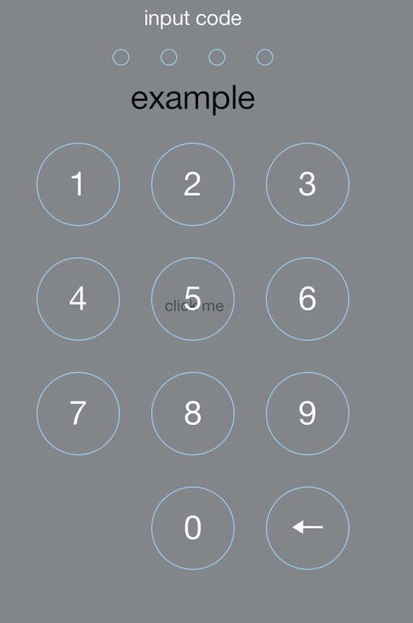

YLSSimplePasswordView
=====================

an password input view component for IOS7, it looks like ios7 native screen lock view



# Getting Started
## import
```
#import "YLSSimplePasswordView.h"
```

## implement both delegate methods
```
#pragma mark - YLSSimplePasswordViewDelegate method

-(BOOL) passwordCorrect:(NSString*)input
{
    if([input isEqualToString:@"1111"]){
        return YES;
    }
    return NO;
}

-(void) inputDone
{
    [self.presentingViewController dismissViewControllerAnimated:YES completion:nil];
}
```

you need to implement both delegate methods:

```
-(BOOL) passwordCorrect:(NSString*)input
```
will be invoked after user input 4 characters, the delegate (usually is a UIViewController instance) use this method to tell the View if the code is correct or not

if the return value is YES, then another delegate method
```
-(void) inputDone
```
will be called, you decide what to do at this point, for example, maybe close the modal window, or show a message, or insert some data into sqlite database...

if the return value is NO, then the input field will shaked, and ask user to input again

# best practise

there is no constraint about how to use this component, you can set it as a root view of a UIViewController, or attach it to another view

also, the ViewController who hold this view, can be presented by modal, or by a NavigationController, as a window or full screen

however, in my opinion, use it as a rootview, and present the viewcontroller as a modal window, looks best. following is how i use it in our app

```
ScreenLockViewController *screenLockViewController = [[ScreenLockViewController alloc] init];
screenLockViewController.modalPresentationStyle = UIModalPresentationFormSheet;// modal window
        
[self presentViewController:screenLockViewController animated:YES completion:nil];
```
```
-(void) loadView
{
    YLSSimplePasswordView *passwordView = [[YLSSimplePasswordView alloc] initWithDelegate:self];
    self.view = passwordView;
}

-(void) viewWillAppear:(BOOL)animated
{
    self.view.superview.backgroundColor = [UIColor clearColor];
}
```

# example
you can see example code in project/example, or run the demo in XCode directly

# 3rd-lib

this component use SMFrameAdditions to handle subview frame, it's already included. however, also you can fetch it at:
<a>https://gist.github.com/nfarina/3412730</a>

# notice

in the source code, i set a ViewTag 2323 for internal use, if your app use this number for ViewTag too, it will be an error

no other constraint there, just feel free

# customize

the view's frame and color is fixed by default, however you can change it by edit the source code, i think it's quite simple

# contact me

welcome to contact me: kyfxbl@gmail.com

your PR or issues would be appreciated
